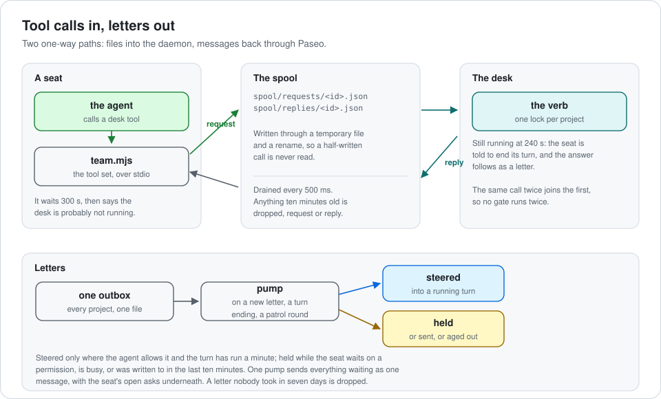

# Architecture

How Seatworks works inside, in one sitting. The [README](../README.md) says what it is and how to
install it. Lookups such as verbs, letters, facts, settings and files are in
[REFERENCE.md](REFERENCE.md).

**One rule shapes everything: the plugin serves SLP and never constrains it.** It owns session
lifecycle, transport, routing, notification, durable state and provenance. Whether the work is right
is always a seat's call.

- [Bird's eye](#birds-eye)
- [Invariants](#invariants)
- [Code map](#code-map)
- [From data to a running seat](#from-data-to-a-running-seat)
- [A lane](#a-lane)
- [Tool calls in, letters out](#tool-calls-in-letters-out)
- [The watch](#the-watch)
- [The concept and the team block](#the-concept-and-the-team-block)
- [The patrol](#the-patrol)
- [Settings](#settings)

## Bird's eye

| Process | Seatworks code in it |
|---|---|
| Paseo daemon | `plugin/server/**`, entered through `index.server.ts` |
| Paseo app | `plugin/client/**`, the panel, entered through `index.client.tsx` |
| A seat: an agent started from a `sw2-<role>-<agent>` provider | Only `bin/seat-room`, the launcher for Claude seats |
| A seat's MCP servers | `mcp/team.mjs` (the desk tools), and `mcp/code.mjs` for proxied servers |

The daemon and the seats share no memory. There are two one-way channels:

- **Seats reach the plugin through files**, the spool.
- **The plugin reaches seats through Paseo**, with `agents.ref(id).send`.

## Invariants

These are mostly absences, so the code won't show them to you.

- **The plugin never judges the work.** A gate result is evidence the Lead weighs. The only verdict
  the desk acts on is a red gate when a lane lands, and the Supervisor can override it.
- **Capabilities, not names.** No code under `server/` compares a role to a name. What a role can do
  (`supervise`, `lead`, `work`, `write`, `review`, `watched`) decides routing,
  acceptance and watching.
- **One door to Paseo.** Only `server/adapters/paseo/` imports Paseo's SDK: it registers the hooks,
  binds the daemon's API from each hook and panel call, and calls the agent, workspace and model API.
  Everything else depends on the ports in `core/ports.ts`, in the plugin's own types, so the tests
  use fakes.
- **One place checks arguments.** `desk/args.ts` checks every call against the schema its seat was
  shown, before any verb runs. Each tool's zod input, which a test holds equal to that schema, types
  what its handler reads; a tool set picks among tools of one name by the schema it shows.
- **One table per lifecycle.** A task, lane, ask or incident changes status only through its table
  in `server/domain/`, checked inside the ledger transaction against the status it has then.
- **One file writes letters.** Everything the desk mails a seat is in `desk/letters.ts`, each letter
  keyed by its kind and ids; what a seat starts from is in `desk/briefs.ts`, and a Lead's directive in
  `desk/directive.ts`.
- **One writer per working copy.** A lane-mode task holds the lane's copy from start until it is
  accepted or cut.
- **No hidden command chain.** When the Supervisor messages a Peer, the Peer's Lead is told first.
- **The watched seat never hears what the watch concluded about it.** No incident is ever addressed
  to it.
- **Nothing a seat reads resolves into a repository.** Skills and guides are copies under
  `content/`, because some agents load the `AGENTS.md` above every file they read.
- **All or nothing.** A seat directory is written only when the whole seat can be built. A kit that
  fails to load leaves the plugin inert, with the problem named.

## Code map

| Path | What it does |
|---|---|
| `server/core/` | The ports, the timeline stream reader, atomic stores, `git`, the gate runner |
| `server/domain/` | Each kind's lifecycle as one transition table: tasks, lanes, asks, incidents. Imports nothing |
| `server/adapters/paseo/` | Paseo itself: its hooks and panel calls in the plugin's own types, and its agent, workspace and model API behind the ports |
| `server/catalog/` | Data to seats: the kit loader, team resolution, providers, seat directories, launch config, content, the project files |
| `server/desk/` | The ledger and what the tools do to it: lanes, tasks, asks, working copies, merges, gates, incidents, letters, closing a lane |
| `server/desk/tools/` | One module per tool the seats call, each a zod input and a handler; `registry.ts` lists them for the desk |
| `server/runtime/` | The composition root and the loops: hooks, spool, outbox, patrol, turn reading, RPC, health |
| `server/runtime/watch/` | The watch: the window over a timeline, the facts read from it and from each lane's record, and the findings they make |
| `client/` | The Seatworks panel |
| `shared/` | What the panel and server share, as zod schemas both take their types from: the RPC contracts (`rpc.ts`), each answer's shape (`views.ts`, which the panel checks every answer against) and the settings layer (`settings.ts`) |
| `mcp/` | `team.mjs`, `code.mjs`, and `tools.json` (the tool sets and their schemas) |
| `bin/` | `seat-room`, the launcher that refuses a seat the plugin did not configure |
| `roles.json` | The SLP preset: roles, capabilities, tool sets, prompts, skills, defaults, attention values |
| `harness/<agent>/` | How each agent is set up: `harness.json`, base and per-role settings, and per-role deltas: what a role's prompt needs said against that agent's own instructions |
| `catalog/` | Optional MCP servers; `ecosystem.json`: gates, one-writer paths, test and docs names, the watch's patterns; `paseo.json`: the tools Paseo gives every agent |
| `content/` | Runtime content that seats read: prompts, skills, guides, the team block. Not documentation |

All paths are under `plugin/`.

## From data to a running seat

1. **Plugin start.** `loadKit` reads `roles.json`, each `harness.json`, the MCP catalog and the tool
   sets. Then the plugin writes one Paseo provider and one agent profile per role and
   agent. The shipped kit makes twenty-five: five roles on five agents. It reloads the daemon only when
   something changed.
2. **Before `agent.create`.** `Seating.ensure` builds the seat directory. This covers settings, deny
   rules, the sandbox, MCP servers, skills linked to copies outside any repository, and the working
   rules. `applyRole` then sets the model, thinking level, mode, prompt and MCP servers.
3. **Before `agent.session_open`.** The plugin points the agent's config directory at the seat
   directory and sets `SEATWORKS_ROLE`, `SEATWORKS_PROJECT` and `SEATWORKS_STATE`. It also seeds the
   project's records, such as `notebook.md`, and writes the
   [team block](#the-concept-and-the-team-block) into the project.
4. **`bin/seat-room`** checks the launch and then `exec`s Claude. Codex, Pi, Oh My Pi and OpenCode seats start
   through Paseo's own providers.

The content lint runs during the build. A role prompt, a working rule or a skill that uses a word
from the role's `hidesWords` fails the build. For example, a Peer may not read "seat". Only
`{{guides}}` and `{{state}}` are allowed as placeholders.

Each role declares in `roles.json` what it writes under the project's state (`writes`: a file, or a
folder ending in `/`). On Claude Code and Codex, a seat's shell may write there and nowhere else under
state. The lint fails a prompt, rule or skill that names a path under state (`{{state}}/…` or
`$SEATWORKS_STATE/…`) its role does not write, unless it is the desk's own record, which seats only
read. A role may not declare the desk's own files, and only the Supervisor writes `CONTEXT.md`. Pi,
Oh My Pi and OpenCode have no sandbox.

What each agent's seat directory holds is in [the reference](REFERENCE.md#seat-directories).

## A lane

The **ledger** (`ledger.json`, one per project) holds lanes, tasks, asks, agents and slots. Every
change is one synchronous transaction: the ledger is read, decided on and saved with nothing awaited
in between, so no other change can land in the middle. A ledger it can't read is refused, never
treated as empty.

**Where a lane works.**

- The first lane works in your own checkout, on a branch `lane/<id>-<title>`. The checkout must be
  clean, but a change that is only the team block doesn't count.
- A later lane, or one that asks to be isolated, gets a git worktree slot of its own.

**Two task modes.**

- **Lane mode**, the default. The task shares the lane's copy and branch. `accept` marks it merged
  in place.
- **Parallel mode.** The task gets its own slot and `task/…` branch. `accept` queues it, and one merge
  queue per project merges branches into their lane, one at a time. The queue is the tasks' status in
  the ledger, so a restart picks it up: a merge cut off midway is undone and run again, and one git had
  already made is only recorded.

**Landing.** `land_lane` does four things in a fixed order:

1. If the base moved, merge the base into the lane, in the lane's copy. A conflict here is the Lead's
   to settle.
2. Run the gate on the result.
3. Read what the lane changed since it left its base. If it touches a path in the project's `askFirst`,
   the landing waits for the Human's approval on the panel; nothing else makes it wait.
4. Fast-forward the base to the lane branch.

A seat mid-turn, a conflict or a red gate refuses the call and leaves the lane open. Only a red gate
can be overridden, with `overGate`, and the override is written to `events.log`. Everything else the
desk reads of the lane (a missing READY, deleted or weakened tests, files outside the write set, open
incidents, what its reviews leave standing) goes with the READY letter and the reply as evidence.

**Teardown** waits for seats that are still mid-turn. The pending release is recorded in the ledger,
and a seat waiting to be archived in `intents.json`, so a daemon restart loses neither: the first
round after it treats every turn that ended meanwhile as ending then. Your checkout goes back to base. A landed lane's branch is
deleted, and one closed without landing is kept for you.

**The first gate.** The first `open_lane` of a project with no recorded gate detects one from the
project's files, for example `npm test` or `cargo test`. `set_project` changes it.

## Tool calls in, letters out

**In.** A seat calls a desk tool. `team.mjs` writes the call as a file under `spool/requests/`.
The daemon drains the spool every 500 ms, checks the arguments, runs the verb and writes a reply.
A call still running after 240 s is answered with "the answer arrives as mail". That promise is
kept in `intents.json` until the letter is posted; if the plugin stops first, the seat is told NO
ANSWER when it starts again.

**Out.** Every letter goes into one `outbox.json`. Mail to a seat is pumped when a letter is
posted, when a turn ends, and after each patrol round. Everything waiting for one seat goes out as
a single message.

- **Steered** into a running turn only when its agent can take a steer and the turn has run at
  least 60 s.
- **Held** while the seat waits on a permission, is busy, or had mail in the last 10 minutes.
- **Sent** otherwise.

**Reading turns.** At every turn end, `TurnRules` reads the turn in code, with no model call:

- A failed turn is reported to the seat's owner.
- A Peer or Reviewer whose turn ends without a desk call is nudged. On the second such turn, its task
  is marked `stalled` and the Lead is told.

## The watch

**What is watched.** Every live seat whose role can be `watched`: Leads and Peers in the preset,
never a Reviewer. `core/stream.ts` joins Paseo's live timeline with its paged history, reading back
what a join, a gap or a reconnect missed, and folds it into a window of at most 80 entries per seat:
calls, words, thoughts, instructions and errors. A seat whose subscription fails is followed again on
the next round.

**Facts, in code.** Every turn is read for facts, and every lane's record for shapes that span
turns. Each fact has a level:

- **`page`**, e.g. `destructive`. It goes out at once.
- **`attend`**, e.g. `stuck`, `test-weakened` or `unverified`. It counts against the day's budget.
- **`note`**, e.g. `gate-failed`. It is only evidence.

The full list is in [the reference](REFERENCE.md#facts).

**Incidents.** Each finding joins the open incident for its seat and kind, or opens one, in
`incidents.json`. It is sent at most once, as an INCIDENT letter:

- An `attend` incident about a Peer goes to the Lead of its lane.
- One about a Lead, a `page`, or one whose Lead is gone goes to the Supervisor.
- It never goes to the watched seat.
- A `page` also reaches the Human's phone, through a Pager started for it: an agent with no tools and
  no parent, whose first and only reply is two lines the desk writes, which Paseo pushes.

Until it is sent, it may be held: in **shadow** (mailing is off, the default; a page is sent
anyway), over the day's **budget**, or with **nobody** to tell.

**Marking.** Whoever gets an incident marks it with `mark_incident`, as `useful`, `noise` or `unknown`, after
checking the agent's own record.

## The concept and the team block

**`CONTEXT.md` is the Human's word.** It lives in the project's state, never in the repo. It holds
only what the project does, its logic, how it behaves, and the words it is spoken of in. The
Supervisor settles new work with you through the `grilling` skill and writes each answer there,
following `guides/CONTEXT_FORMAT.md`. The desk never writes in it. It only names the file in a Lead's
directive once the file exists.

**The team block is shared context.** `content/project/AGENTS.md` holds what every role would
otherwise repeat: who does what, the git limits, how mail works. When a seat's session opens,
`catalog/project-files.ts` writes it into the project's own `AGENTS.md` between `seatworks:begin` and
`seatworks:end`, and adds an `@AGENTS.md` pointer to `CLAUDE.md`. Every role reads it, so the kit
refuses a block that uses any role's hidden words.

## The patrol

A timer runs a round every `tickSeconds`, 30 s by default. Rounds never overlap. Each step is guarded
on its own, so one broken project doesn't stop the round. For each project, in order:

1. Tell the Supervisor about idle lanes.
2. Retell held incidents that had nobody to tell.
3. Mark tasks whose Peer is gone.
4. Remind open asks, re-address ones whose reader is gone, and escalate ones nobody answered.
5. Read each lane's record for facts.
6. Sweep stray workspaces and worktrees, and finish held teardowns.
7. Write `status.md`.

Then it pumps every seat that has mail.

## Settings

There are two JSON layers: the machine layer (`~/.local/share/seatworks-v3/settings.json`) and a
project layer. For any single value the project wins, and rules from both are joined. Unknown keys
are refused.

- A save carries the revision it read. If the file changed since, the save answers `conflict`.
- A save that would make a buildable seat unbuildable is refused.
- A broken file is reported by the position where parsing stopped, never by its text, because that
  text might be a key.
- A `roles.json` in the state root replaces the shipped preset whole.

Every setting and its default is in [the reference](REFERENCE.md#settings).
